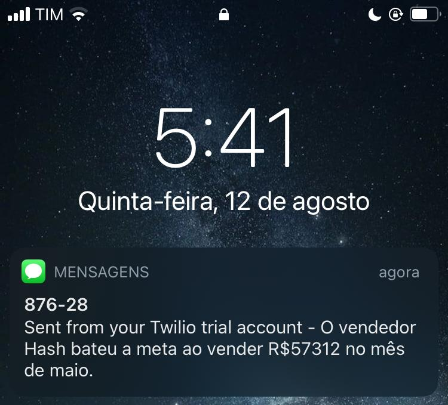
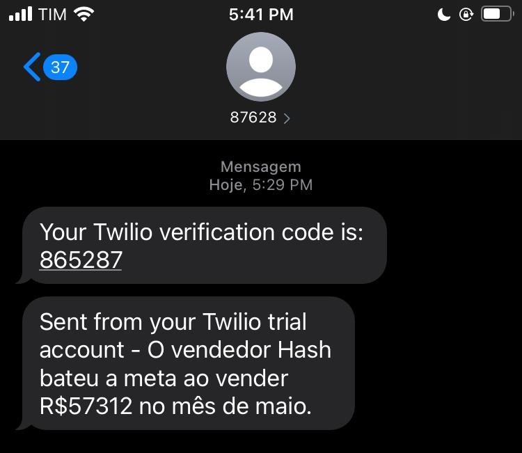

# This was my first code using python
I started this project because I'm currently learning Python, so I thought that practical exercises would be nice to improve my programming skills and knowledge. This was created while I was watching a tutorial video, since it's my very first project in Python, and the beginning of my journey.
### The plot behind this project is
There is a company with 1k sellers. If any of them hit the target of selling more than 50k in a month, he/she will get airplane tickets for free to go on vacations with all of it's family.
### What I did
I created a program that analyses 6 excel files from 6 months of work in this company, each one of them with one thousand names of people and one thousand selling data.
Then, it checks if there is someone who sold more than 50k, and sends me a sms telling me the name, the value sold and the month.   
Check the results below:  

 
I made it in portuguese since it's my native language and the tutorial was in portuguese, but it basically says "The seller Hash hit the target by selling R$57312 in may"
### What I used
* Python
* Visual Studio Code
* Pandas
* Twilio
* Openpyxl
### Credits
[Hashtag Programação](https://www.youtube.com/watch?v=GQpQha2Mfpg)
